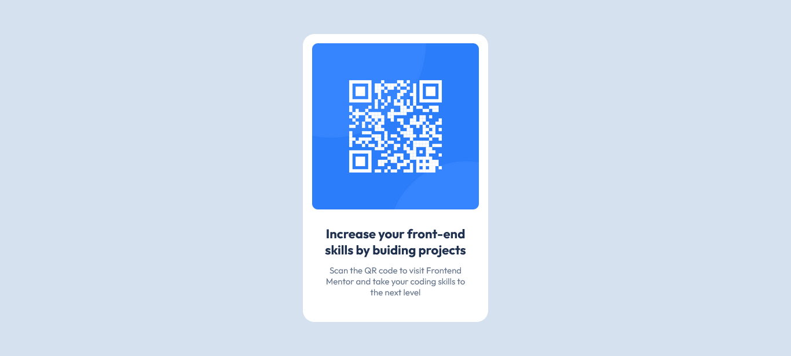

# Frontend Mentor - QR code component solution

This is a solution to the [QR code component challenge](https://www.frontendmentor.io/challenges/qr-code-component-iux_sIO_H) on Frontend Mentor. Frontend Mentor challenges help you improve your coding skills by building realistic projects. 

## Table of contents

- [Overview](#overview)
  - [Screenshot](#screenshot)
  - [Links](#links)
- [My process](#my-process)
  - [Built with](#built-with)
  - [What I learned](#what-i-learned)
  - [Continued development](#continued-development)
  - [Useful resources](#useful-resources)
- [Author](#author)

## Overview

### Screenshot

### Links

- Solution URL: [GitHub Repository](https://github.com/primas-mkai/frontend-mentor/tree/main/qr-code-component-main)
- Live Site URL: [GitHub Pages](https://primas-mkai.github.io/frontend-mentor/qr-code-component-main/)

## My process

### Built with

- Semantic HTML5 markup  
- CSS3 (external stylesheet)  
- Flexbox for centering  
- Google Fonts (Outfit)  
- Responsive design with media queries  

### What I learned

- How to center content using Flexbox  
- How to apply responsive design with media queries  
- How to structure a simple card layout with semantic HTML  

### Continued development

- Improve accessibility with ARIA roles and better alt text  
- Add hover effects and transitions for interactivity  
- Explore CSS Grid for more complex layouts  

### Useful resources

- [CSS Tricks - Flexbox Guide](https://css-tricks.com/snippets/css/a-guide-to-flexbox/)  
- [MDN Web Docs - Responsive Design](https://developer.mozilla.org/en-US/docs/Learn/CSS/CSS_layout/Responsive_Design)  

## Author

- GitHub - [@primas-mkai](https://github.com/primas-mkai)  
- Frontend Mentor - [@primas-mkai](https://www.frontendmentor.io/profile/primas-mkai)  
